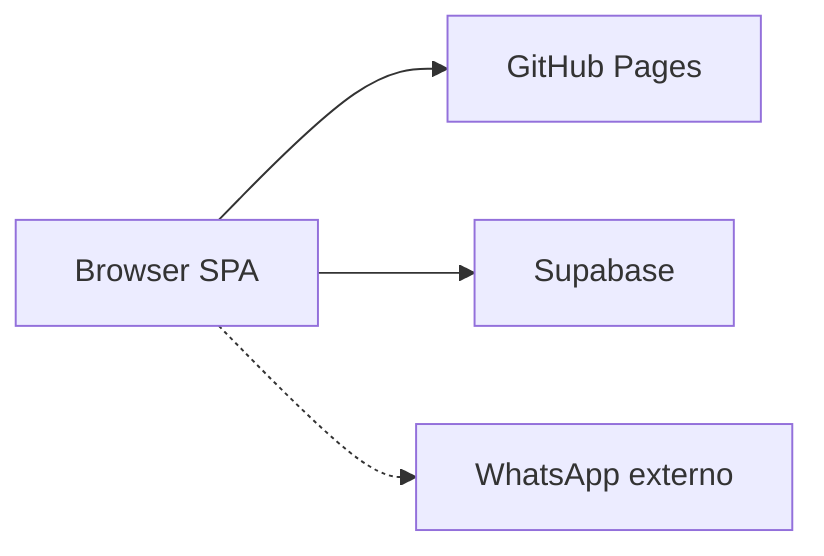

# Arquitetura

Níveis usados: **Contexto → Sistema → Unidades deployáveis → Componentes → Implementação**. Não há segundo runtime de API neste repo.

## Contexto



- **GitHub Pages** serve o `dist/` gerado pelo Vite (workflow `deploy.yml`).
- **Supabase** autentica, guarda dados, arquivos e publica mudanças Realtime.
- **WhatsApp** é aberto via URL a partir do catálogo público; não há SDK WhatsApp no `package.json`.

## Sistema

Uma aplicação: `package.json` name `olivelas-gestao-estoque`. React 19, React Router 7, TanStack Query 5, Zustand, Tailwind 3, cliente `@supabase/supabase-js`.

`App.tsx`: `QueryClientProvider` (staleTime 5 min), `BrowserRouter` com `basename={import.meta.env.BASE_URL}`, `Toaster` sonner `top-right`, `initAuth()` no mount.

## Unidades deployáveis

| Unidade | Onde | Papel |
| --- | --- | --- |
| SPA estática | `dist/` após `npm run build` | UI |
| Projeto Supabase | migrations em `supabase/migrations/` | Auth, DB, Storage, RPCs, Realtime |

`FULL_DATABASE_SETUP.sql` é um arquivo agregado no mesmo diretório de migrations. **Não tratar como migration adicional** sem conferir o que já foi aplicado no projeto remoto (risco de duplicar objetos). Fonte canônica incremental: arquivos datados `20260925*` … `20260927*`.

## Componentes de responsabilidade (não cada arquivo)

| Componente | Responsabilidade | Não-responsabilidade |
| --- | --- | --- |
| Rotas e layouts | Shell marketing / auth / app / catálogo | Regras de estoque |
| Stores Zustand | Sessão (`authStore`), tema (`themeStore`), carrinho público (`cartStore`), i18n | RLS |
| Services | Chamadas `supabase.from` / `rpc` | Render |
| PostgreSQL + RLS | Isolamento e transações de estoque | Layout |
| Storage | Imagens produtos/loja/avatar | Metadados de produto (tabelas SQL) |

## Fluxo de sessão (implementação)

1. `authStore.initAuth` → `authService.getCurrentUser` + `getUserStores`.
2. Cache em `localStorage`: `olivelas_user_profile`, `olivelas_user_stores`, `olivelas_active_store_id`.
3. Token Supabase: `storageKey: 'olivelas_supabase_auth_token'`.
4. `ProtectedRoute`: loading spinner; se não autenticado → `/login`; se `requireGlobalAdmin` e não admin → `/dashboard`.

## Organização de `src/`

```text
src/
  components/admin|common|inventory|products|sales|settings|ui
  hooks/          useAuth, useTenant, usePermissions, useRealtime, useI18n, useTheme, useTablePagination
  i18n/           pt-BR, en-US, es-ES
  layouts/        AppLayout, AuthLayout, PublicLayout
  lib/            supabase/client.ts, storeThemes.ts
  pages/
  routes/         AppRoutes, ProtectedRoute, PermissionGate
  services/
  stores/         authStore, cartStore, themeStore
  types/
  utils/
```

Alias `@` → `./src` (`vite.config.ts`).

## Relacionamentos

- Inventário UI: [frontend-inventory.md](frontend-inventory.md)
- Inventário dados: [backend-inventory.md](backend-inventory.md)
- Contratos: [contracts.md](contracts.md)
