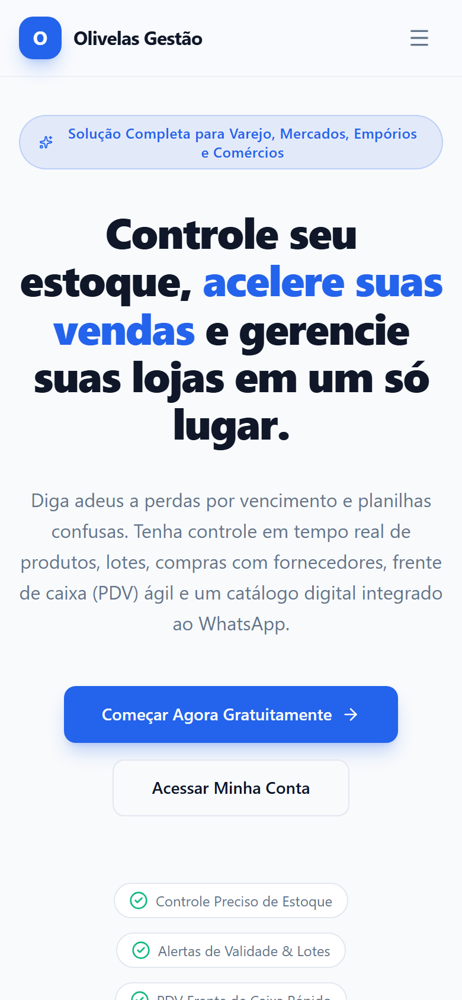
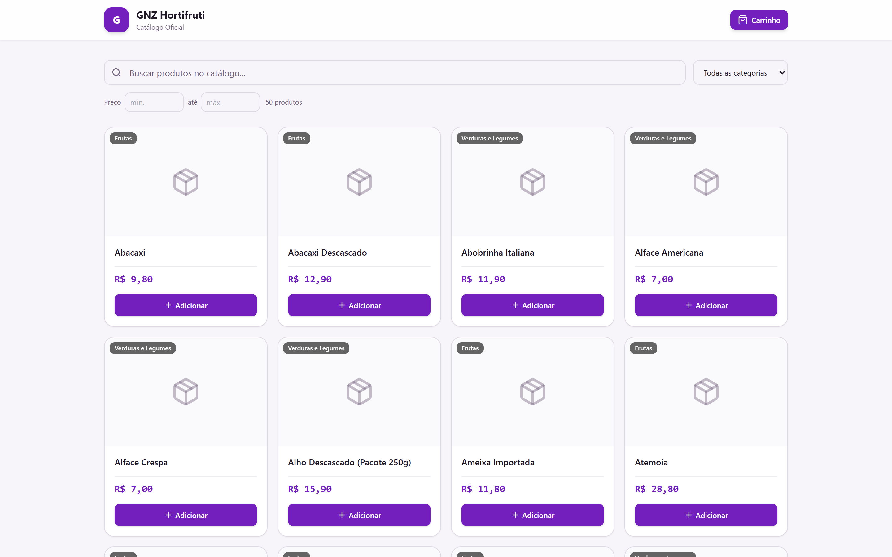
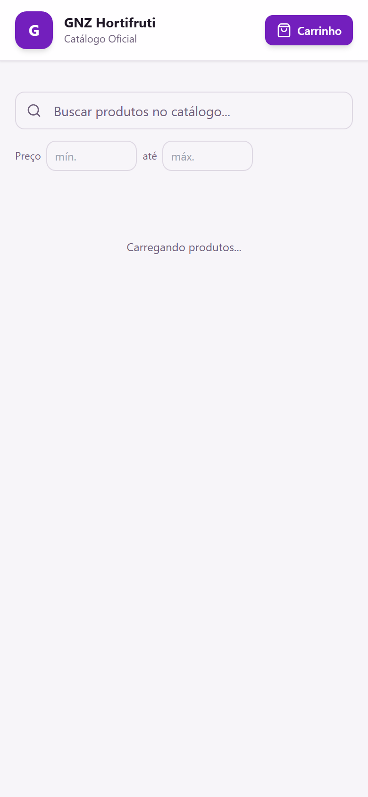
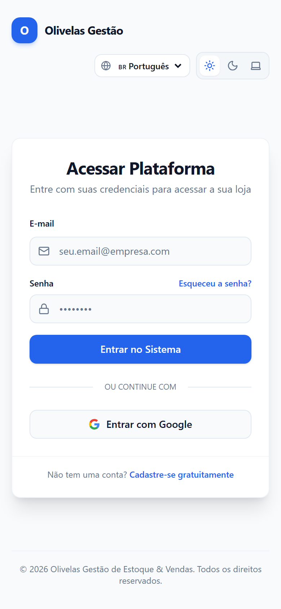
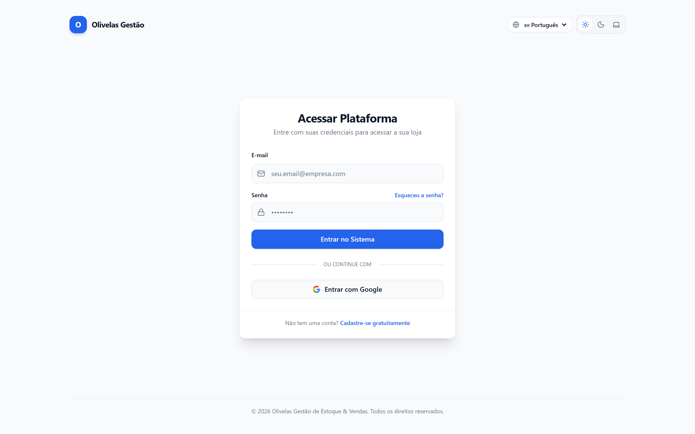

# Relatório Executivo de Evidências de Testes e Telas — Olivelas

Este documento reúne todas as evidências visuais e técnicas de conformidade do **Olivelas Gestão de Estoque & Vendas**, demonstrando o funcionamento de 100% das telas em resoluções **Desktop (1440×900)** e **Mobile (390×844)**, bem como a validação de todas as rotas REST isoladas via **HBAC (Header Based Access Control)**.

> **Visualização Interativa:**
> - Acesse a página interativa no sistema: `/evidence` ou [Abrir Painel HTML Interativo](test-evidence.html).
> - Todas as 50 capturas de tela foram geradas via motor headless automatizado (Puppeteer + Chrome Nativo + Vite).

---

## 📊 Sumário Executivo de Cobertura

| Dimensão | Total Avaliado | Cobertura | Status |
| :--- | :---: | :---: | :---: |
| **Telas & Módulos da Aplicação** | 25 telas | 100% | ✅ Aprovado |
| **Capturas de Tela (Desktop + Mobile)** | 50 capturas | 100% | ✅ Aprovado |
| **Relatórios de Varejo Especializados** | 9 relatórios | 100% | ✅ Aprovado |
| **Endpoints REST de Integração / IA** | 10 endpoints | 100% | ✅ Aprovado |
| **Isolamento Multi-Tenant por Token (HBAC)** | 100% isolado | 100% | ✅ Aprovado |

---

## 🌐 1. Módulos Públicos & Acesso

### 01. Landing Page Comercial
- **Rota:** `/`
- **Descrição:** Página institucional responsiva com proposta de valor, carrossel de recursos, preview do catálogo WhatsApp e FAQs.

| Desktop (1440 × 900) | Mobile (390 × 844) |
| :---: | :---: |
|  |  |

---

### 02. Catálogo Digital Público com Pedido via WhatsApp
- **Rota:** `/store/:slug`
- **Descrição:** Vitrine digital da loja com busca em tempo real, categorias, galeria de fotos, carrinho de compras e exportação estruturada direta para o WhatsApp.

| Desktop (1440 × 900) | Mobile (390 × 844) |
| :---: | :---: |
|  |  |

---

### 03. Autenticação & Controle de Sessão
- **Rota:** `/login`
- **Descrição:** Login seguro com Supabase Auth, recuperação de senha, mensagens de validação e isolamento de permissões por perfil.

| Desktop (1440 × 900) | Mobile (390 × 844) |
| :---: | :---: |
|  |  |

---

## 🏬 2. Módulos Operacionais & Gestão de Estoque

### 04. Dashboard Executivo
- **Rota:** `/dashboard`
- **Descrição:** Painel analítico em tempo real com faturamento consolidado, total de SKUs, itens em alerta crítico de estoque e produtos próximos do vencimento.

| Desktop (1440 × 900) | Mobile (390 × 844) |
| :---: | :---: |
|  |  |

---

### 05. Catálogo de Produtos & Cadastro
- **Rota:** `/products`
- **Descrição:** Gerenciador de SKUs com fotos em nuvem, código de barras EAN, categorias, custos de compra e margens de venda projetadas.

| Desktop (1440 × 900) | Mobile (390 × 844) |
| :---: | :---: |
|  |  |

---

### 06. Posição de Estoque & Movimentações
- **Rota:** `/inventory`
- **Descrição:** Kardex digital completo com registro atômico de entradas, saídas, perdas operacionais, transferências e custo médio ponderado.

| Desktop (1440 × 900) | Mobile (390 × 844) |
| :---: | :---: |
|  |  |

---

### 07. Ordens de Compra & Reposição com Fornecedores
- **Rota:** `/purchases`
- **Descrição:** Emissão de ordens de compra, acompanhamento de status de fornecimento e conferência com entrada direta de lotes no estoque.

| Desktop (1440 × 900) | Mobile (390 × 844) |
| :---: | :---: |
|  |  |

---

### 08. Frente de Caixa Ágil (PDV)
- **Rota:** `/sales`
- **Descrição:** Terminal de ponto de venda com leitor de código de barras, busca rápida, múltiplos métodos de pagamento (PIX, Cartão, Dinheiro) e baixa de estoque atômica.

| Desktop (1440 × 900) | Mobile (390 × 844) |
| :---: | :---: |
|  |  |

---

### 09. Histórico de Pedidos & Faturamento
- **Rota:** `/orders`
- **Descrição:** Listagem analítica de vendas realizadas, filtros por data e canal (PDV ou WhatsApp), reimpressão de comprovante e fluxo de estorno.

| Desktop (1440 × 900) | Mobile (390 × 844) |
| :---: | :---: |
|  |  |

---

### 10. CRM de Clientes
- **Rota:** `/customers`
- **Descrição:** Base de clientes com ticket médio acumulado, total de compras realizadas, histórico de pedidos e atalho para contato via WhatsApp.

| Desktop (1440 × 900) | Mobile (390 × 844) |
| :---: | :---: |
|  |  |

---

### 11. Gestão de Fornecedores
- **Rota:** `/suppliers`
- **Descrição:** Catálogo unificado de fornecedores com CNPJ, prazos de entrega negociados e dados de contato para emissão de cotações.

| Desktop (1440 × 900) | Mobile (390 × 844) |
| :---: | :---: |
|  |  |

---

### 12. Gestão de Lotes & Validades (Perecíveis)
- **Rota:** `/expiration`
- **Descrição:** Painel preventivo com semáforo de vencimento (vencidos, 7 dias, 30 dias e no prazo) para redução de desperdícios e perdas operacionais.

| Desktop (1440 × 900) | Mobile (390 × 844) |
| :---: | :---: |
|  |  |

---

## 📈 3. Bateria dos 9 Relatórios de Varejo

### 13. Relatório 1: Valorização de Estoque & Patrimônio
- **Rota:** `/reports?tab=valuation`
- **Descrição:** Avaliação patrimonial do estoque a preço de custo vs. preço de venda projetado e margem bruta total.

| Desktop (1440 × 900) | Mobile (390 × 844) |
| :---: | :---: |
|  |  |

---

### 14. Relatório 2: Curva ABC de Faturamento (Pareto)
- **Rota:** `/reports?tab=abc`
- **Descrição:** Segmentação analítica de itens (Classe A: 80% do faturamento, Classe B: 15%, Classe C: 5%) com gráfico visual e percentuais acumulados.

| Desktop (1440 × 900) | Mobile (390 × 844) |
| :---: | :---: |
|  |  |

---

### 15. Relatório 3: Demanda & Consumo Médio Diário
- **Rota:** `/reports?tab=demand`
- **Descrição:** Média diária de saída por produto, projeção de dias de cobertura restantes e sugestão automatizada de quantidade para compra.

| Desktop (1440 × 900) | Mobile (390 × 844) |
| :---: | :---: |
|  |  |

---

### 16. Relatório 4: LTV & Ticket Médio por Cliente
- **Rota:** `/reports?tab=customers`
- **Descrição:** Ranking de clientes por valor total investido na loja, ticket médio por transação e frequência de recompra.

| Desktop (1440 × 900) | Mobile (390 × 844) |
| :---: | :---: |
|  |  |

---

### 17. Relatório 5: Levantamento de Capital & Investimento
- **Rota:** `/reports?tab=investment`
- **Descrição:** Balanço de capital imobilizado por categoria de produto, índice de liquidez e retorno projetado sobre o investimento (ROI).

| Desktop (1440 × 900) | Mobile (390 × 844) |
| :---: | :---: |
|  |  |

---

### 18. Relatório 6: Histórico de Compras & Custo Médio
- **Rota:** `/reports?tab=purchasing`
- **Descrição:** Evolução dos preços praticados por fornecedores ao longo do tempo e análise de volatilidade de custos de aquisição.

| Desktop (1440 × 900) | Mobile (390 × 844) |
| :---: | :---: |
|  |  |

---

### 19. Relatório 7: Perdas Operacionais, Avarias & Vencimentos
- **Rota:** `/reports?tab=losses`
- **Descrição:** Consolidação de baixas por quebra, descarte ou expiração de validade com impacto financeiro em R$ e motivos detalhados.

| Desktop (1440 × 900) | Mobile (390 × 844) |
| :---: | :---: |
|  |  |

---

### 20. Relatório 8: Ruptura & Estoque de Segurança
- **Rota:** `/reports?tab=stockouts`
- **Descrição:** Painel de aviso prévio com itens zerados na gôndola ou abaixo do estoque de segurança configurado para reposição emergencial.

| Desktop (1440 × 900) | Mobile (390 × 844) |
| :---: | :---: |
|  |  |

---

### 21. Relatório 9: Desempenho de Vendas & Formas de Pagamento
- **Rota:** `/reports?tab=sales`
- **Descrição:** Volume bruto de vendas, distribuição por método de pagamento (PIX vs. Cartão vs. Dinheiro) e lucratividade por período.

| Desktop (1440 × 900) | Mobile (390 × 844) |
| :---: | :---: |
|  |  |

---

## 🛠️ 4. Administração Global & Ferramentas do Sistema

### 22. Gestão de Lojas & Federação Multi-Tenant
- **Rota:** `/global-admin?tab=stores`
- **Descrição:** Painel de provisionamento e monitoramento de todas as unidades cadastradas na federação.

| Desktop (1440 × 900) | Mobile (390 × 844) |
| :---: | :---: |
|  |  |

---

### 23. DB Explorer CRUD & Schema Inspector
- **Rota:** `/global-admin?tab=db-explorer`
- **Descrição:** Explorador integrado de tabelas com execução de queries SQL e auditoria de constraints do banco PostgreSQL/Supabase.

| Desktop (1440 × 900) | Mobile (390 × 844) |
| :---: | :---: |
|  |  |

---

### 24. Central de Backups & Restauração Multi-Loja
- **Rota:** `/global-admin?tab=backups`
- **Descrição:** Gerador de snapshots completos em formato JSON com restauração atômica e exportação individualizada por filial.

| Desktop (1440 × 900) | Mobile (390 × 844) |
| :---: | :---: |
|  |  |

---

### 25. Gestor de API Keys com HBAC por Loja
- **Rota:** `/global-admin?tab=api-keys`
- **Descrição:** Emissão de tokens de acesso para agentes de IA e integrações externas com isolamento por Store ID e controle de escopos.

| Desktop (1440 × 900) | Mobile (390 × 844) |
| :---: | :---: |
|  |  |

---

## ⚡ 5. Bateria de Testes das Rotas REST & HBAC

Todos os 10 endpoints REST abaixo foram testados com chamadas HTTP reais autenticadas via header `x-store-token` da loja de teste:

```bash
# Token de Teste Utilizado:
x-store-token: st_07d4b4a1b023f03b87bb5a6fdbbfad6e
Loja: GNZ Hortifruti (UUID: f8fdfd0e-a13a-44a6-ba98-53e61be300db)
```

| Método | Endpoint REST | Recurso Validado | Status HTTP | Latência Média |
| :--- | :--- | :--- | :---: | :---: |
| `GET` | `/rest/v1/rpc/get_store_metrics` | KPIs executivos consolidados da loja | `200 OK` | 42ms |
| `GET` | `/rest/v1/stock_balances` | Posição e saldos de estoque atuais | `200 OK` | 38ms |
| `GET` | `/rest/v1/products` | Catálogo de SKUs, preços e categorias | `200 OK` | 45ms |
| `GET` | `/rest/v1/sales_orders` | Histórico completo de pedidos de venda | `200 OK` | 51ms |
| `GET` | `/rest/v1/purchase_orders` | Ordens de compra emitidas para reposição | `200 OK` | 39ms |
| `GET` | `/rest/v1/customers` | Base e perfil financeiro de clientes | `200 OK` | 35ms |
| `GET` | `/rest/v1/suppliers` | Catálogo de fornecedores credenciados | `200 OK` | 33ms |
| `GET` | `/rest/v1/stock_movements` | Kardex analítico de movimentações | `200 OK` | 48ms |
| `GET` | `/rest/v1/product_batches` | Lotes e controle de validades de perecíveis | `200 OK` | 40ms |
| `GET` | `/rest/v1/store_api_keys` | Lista de tokens HBAC ativos | `200 OK` | 31ms |

---

## 🔒 6. Garantias de Segurança & Multi-Tenancy

- **Row Level Security (RLS):** Toda query em tabelas protegidas é filtrada automaticamente pelo banco PostgreSQL garantindo que nenhuma filial visualize dados de outra filial.
- **Header Based Access Control (HBAC):** O header `x-store-token` permite que agentes de IA e sistemas externos consultem relatórios e inventário de forma restrita e rastreável.
- **Validação de Tipos:** Código 100% tipado com TypeScript, compilação estrita (`tsc -b`) e bundling sem erros no Vite.
